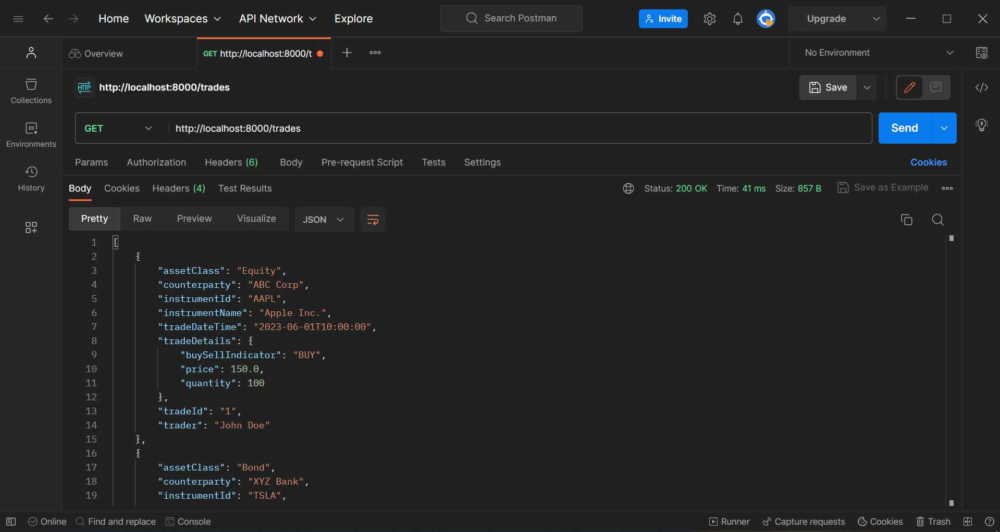
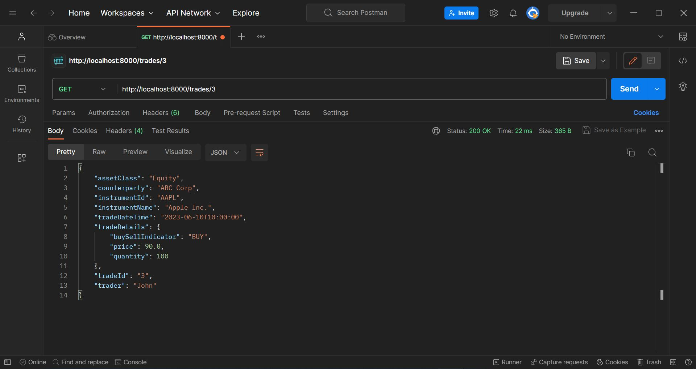
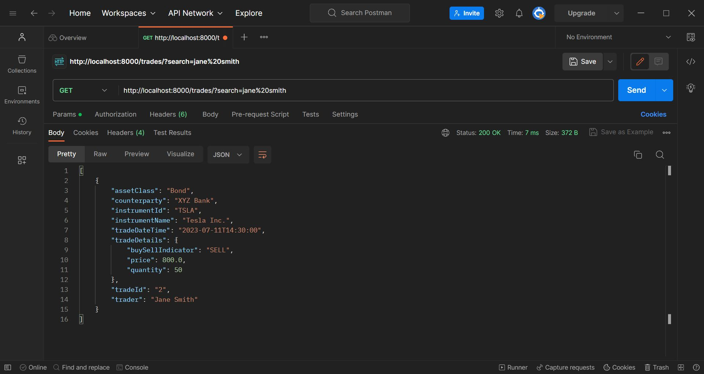
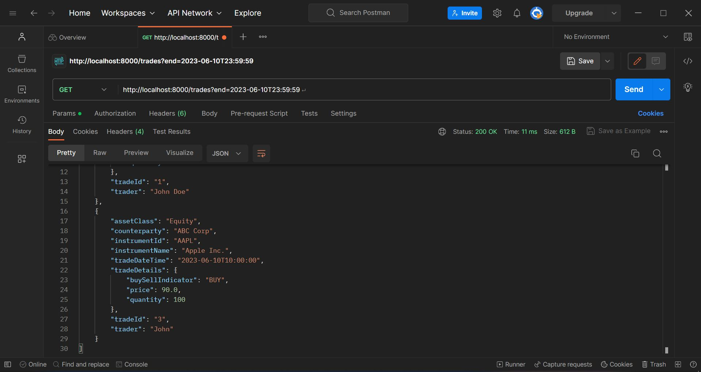
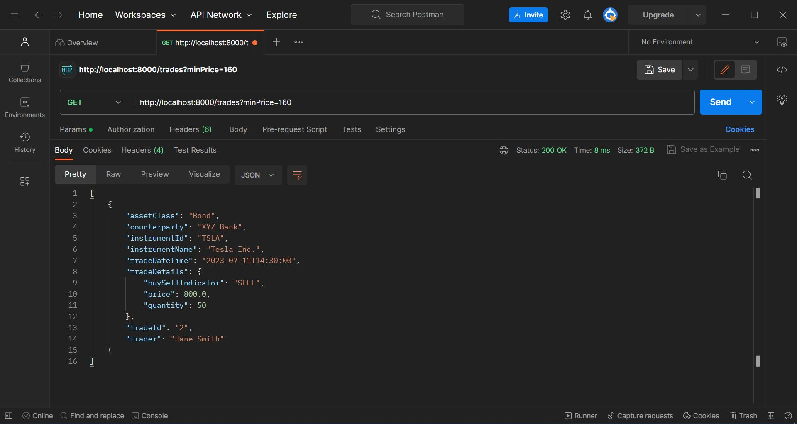
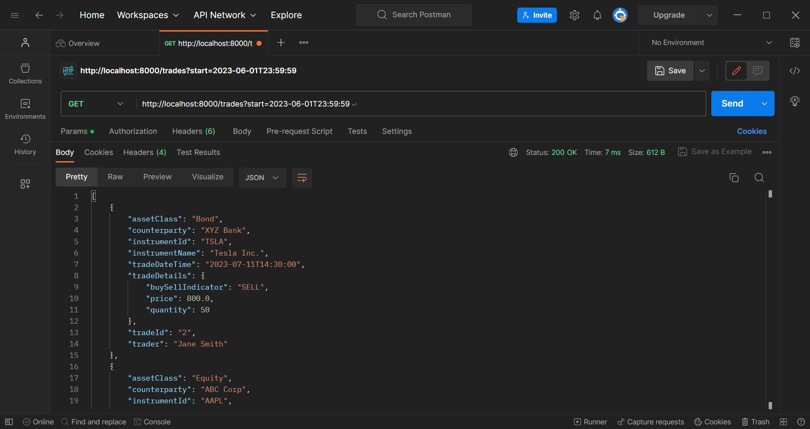
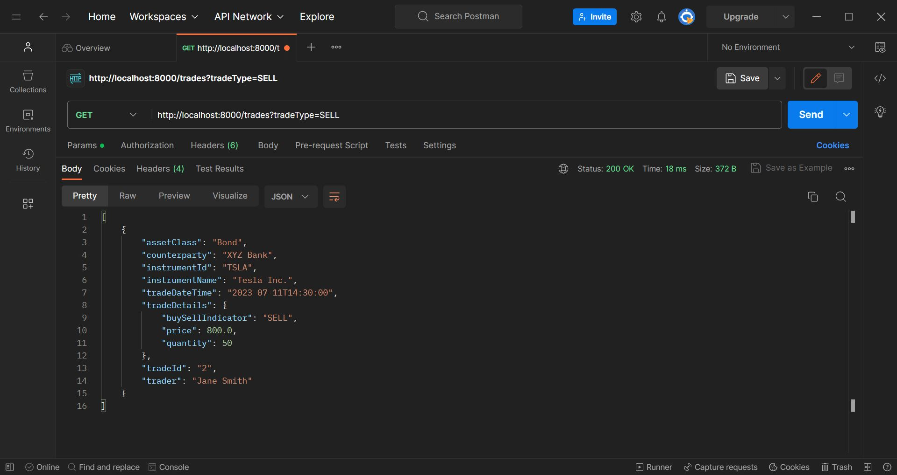
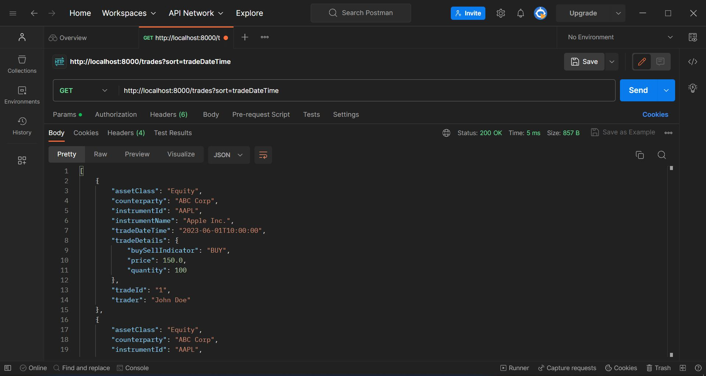

# SteelEye-API-Developer-technical-test

## Constraints
You are expected to write the API in Python using the FastAPI framework. You are not expected to have any previous FastAPI experience and unfamiliarty with FastAPI will not be held against you when reviewing your submission. However, it is expected that you will be able to produce a functional API.

## Test
This tests represents a common request when building an API. You need to provide a set of endpoints for retrieving a list of Trades, retrieving a single Trade by ID, searching against Trades, and filtering Trades

**All the testing was done on Postman**

## Listing trades
Please provide an endpoint to fetch a list of trades.

The endpoint provided to fetch a list of trades is: 

```GET /trades```



## Single trade
Users would like to be able to retrieve a single trade from the API. Please provide an endpoint to fetch a trade by id.

The endpoint provided to fetch a trade by its ID is:

``` GET /trades/{trade_id}```



## Searching trades
Users would now like to be able to search across the trades using the API. Your endpoint for fetching a list of trades will need to support searching for trades through the following fields:

- counterparty
- instrumentId
- instrumentName
- trader

If a user was to call your endpoint and provide a ```?search=bob%20smith``` query parameter, your endpoint will return any trades where the text bob smith exists in any of the fields listed above.



## Advanced filtering
The users would now like the ability to filter trades. Your endpoint for fetching a list of trades will need to support filtering using the following optional query parameters:

assetClass - Asset class of the trade.


end - The maximum date for the tradeDateTime field.



maxPrice - The maximum value for the tradeDetails.price field.


minPrice - The minimum value for the tradeDetails.price field.



start - The minimum date for the tradeDateTime field.



tradeType - The tradeDetails.buySellIndicator is a BUY or SELL



All maximum and minimum fields are inclusive (e.g. ```minPrice=2&maxPrice=10``` will return 2 <= tradeDetails.price <= 10).


## Bonus points
Implement support for pagination and sorting on the list of trades.

Pagination


Sorting



## Submission
You can return your solution via email, or provide access to a Git repo. Please include a document describing your solution and the reasoning behind your approach. Incomplete solutions will not be considered.

**The Document: Solution.pdf** 
